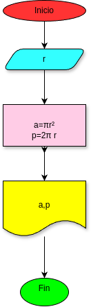

# Programa 1: area_perimetro_circulo
programa en Phyton para calcular el area y el perimetro de un circulo, dado el valor de su radio

## Análisis

### Variables de entrada
- r: radio del circulo

### Procesamiento
- a: Area del circulo
- p: Perimetro del circulo

$a: \pi*r*r$

$p: 2*\pi+r$

## Diseño

## Construcción

- Codigo implementado en el archivo area_perimetro_circulo.py